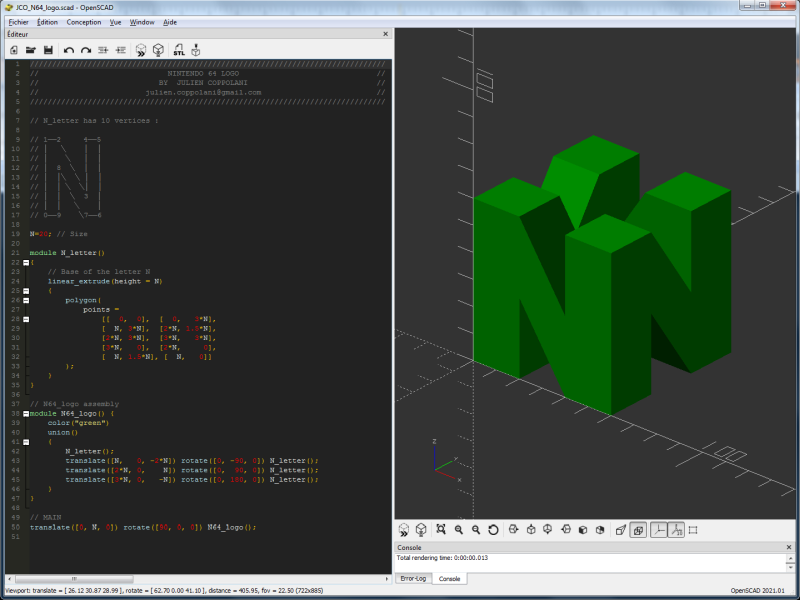
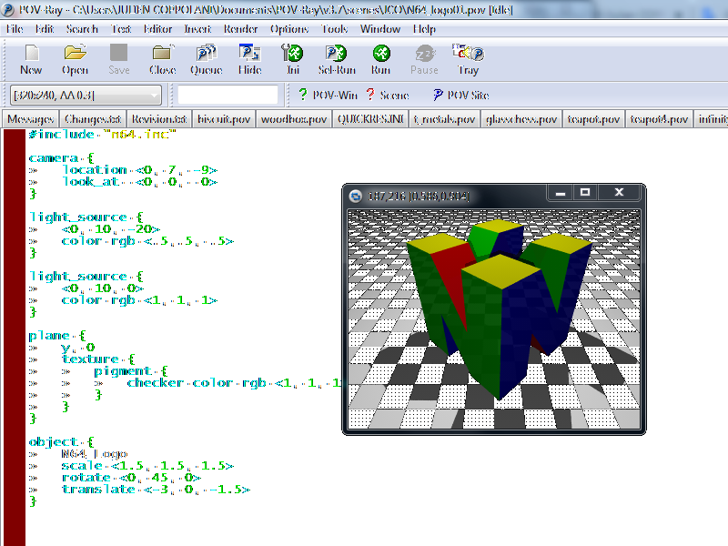
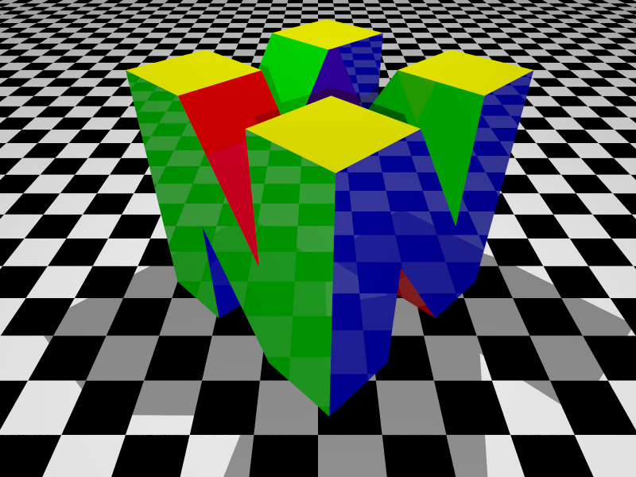
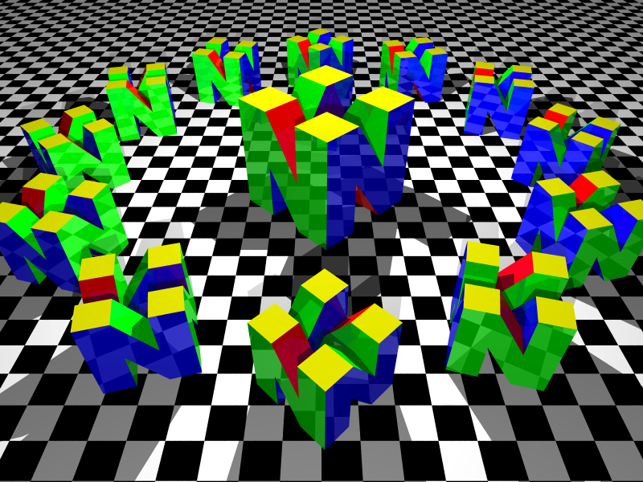

# Nintendo-64-Logo
Nintendo64 logo modeled with OpenSCAD and POV-Ray

## Introduction

OpenSCAD & POV-Ray are 3D modeling softwares and also scripting languages.

Unlike graphical tools like Blender, OpenSCAD and POV-RAY are entirely code-based.

OpenSCAD and POV-Ray use their own scripting language to define geometric shapes, transformations (translation, rotation, etc.), and boolean operations (union, intersection, subtraction).

These languages supports variables and parameters, making it easy to customize and adapt models.

OpenSCAD is widely used for designing objects to be 3D printed. It exports 3D models in the STL format, a well known format to 3D printing enthusiasts.

Here is a screeshot of the OpenSCAD interface :

Whereas POV-Ray (Persistence of Vision Raytracer) is a 3D rendering software based on the ray tracing technique. First released in 1991, it generates realistic 3D images from scene descriptions written in its dedicated scripting language. Free and open source, it is widely used in artistic, educational, and scientific projects. POV-Ray is renowned for its precision, flexibility, and ability to produce photorealistic images with advanced effects such as reflections, transparency, shadows, and procedural textures.

Here is a screeshot of the POV-Ray interface :

## Nintendo64 logo modeled with OpenSCAD

Le code source se trouve dans le fichier **N64_logo.scad**

Le fichier STL généré est le fichier **N64_logo.stl**

Ouvrir le fichier source N64_logo.scad dans Openscad pour l'éditer, cliquer ensuite sur "Calculer le rendu (touche F6), puis sur Exporter comme STL (touche F7).

Vous pourrez ensuite importer le fichier STL dans un slicer comme PrusaSlicer, Cura ou autre slicer, pour impression 3D !

Ma modélisation est également disponible sur Thingiverse, voici le lien : https://www.thingiverse.com/thing:6908540

## Nintendo64 logo modeled with POV-Ray

Le code source se trouve dans le fichier **N64_logo.inc**

Pour utiliser le logo, il suffit, en début de script, d'importer le fichier par l'instruction #include N64_logo.inc

2 fichier scenes pour exemple ont été ajoutés au repository :

N64_logo_example01.pov

N64_logo_example02.pov

Voici ce que donne ces 2 exemples (ici au format 800x600) :

