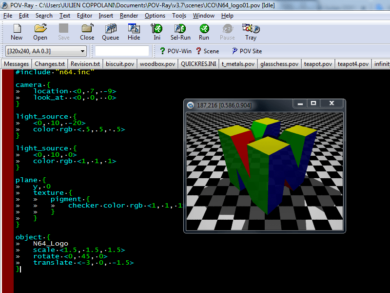

# Nintendo-64-Logo
Nintendo64 logo modeled with OpenSCAD and POV-Ray

## Introduction

OpenSCAD & POV-Ray are 3D modeling softwares and also scripting languages.

Unlike graphical tools like Blender, OpenSCAD and POV-RAY are entirely code-based.

OpenSCAD and POV-Ray use their own scripting language to define geometric shapes, transformations (translation, rotation, etc.), and boolean operations (union, intersection, subtraction).

These languages supports variables and parameters, making it easy to customize and adapt models.

OpenSCAD is widely used for designing objects to be 3D printed. It exports 3D models in the STL format, a well known format to 3D printing enthusiasts.

Here is a screeshot of the OpenSCAD interface :

Whereas POV-Ray (Persistence of Vision Raytracer) is a 3D rendering software based on the ray tracing technique.

First released in 1991, it generates realistic 3D images from scene descriptions written in its dedicated scripting language.

Free and open source, it is widely used in artistic, educational, and scientific projects.

POV-Ray is renowned for its precision, flexibility, and ability to produce photorealistic images with advanced effects such as reflections, transparency, shadows, and procedural textures.

Here is a screeshot of the POV-Ray interface :

## Nintendo64 logo modeled with OpenSCAD

The source code is located in the file **N64_logo.scad**.

The generated STL file is **N64_logo.stl**.

To regenerate it : first open the source file **N64_logo.scad** in OpenSCAD.

Once the file opened, click on "Render" (F6 key) then "Export as STL" (F7 key).

You can then import the STL file into a slicer such as PrusaSlicer, Cura, Bambu Studio, Orca Slicer or any other slicer for 3D printing!

My 3D modeling is also available on Thingiverse, here is the link : https://www.thingiverse.com/thing:6908540

## Nintendo64 logo modeled with POV-Ray

The source code is located in the file **N64_logo.inc**.

To use the logo, first copy the **N64_logo.inc** in the Poy-RAY ini directory (typically /home/user/POV-Ray/v3.7/ini).

Once done, at the beginning of your POV-Ray script, add the instruction **#include "N64_logo.inc"**. That's all!

2 example scenes files have been added to the repository :

N64_logo_example01.pov

N64_logo_example02.pov

Here is what these 2 examples give (here in 800x600 format) :

